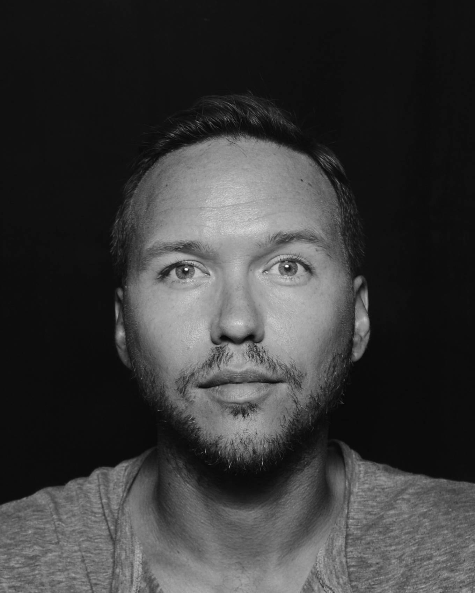

import { Flex, Box, Heading, Text, Link } from "rebass"
import Container from "./../components/Container"
import SEO from "./../components/SEO"
import { sizes } from "./../utils/variables"

<SEO title="About" />

<Container width={sizes.large} sx={{
  display: ['block', 'flex'],
  justifyContent: 'space-evenly'
}}>

<Box width={[2 / 5, 1 / 5]} minWidth={[0, '8em']} mr={[0, 4]}>

###### [LinkedIn](https://www.linkedin.com/in/erow/), [Github](https://github.com/ericrowan), [Résumé](https://www.dropbox.com/s/ssivpf4vq1aeohl/eric-rowan_resume.pdf?dl=0)

</Box>

<Box maxWidth={sizes.xsmall}>

### Design lead and front-end developer creating useful digital experiences.

For over a decade, I&rsquo;ve worked alongside many talented people to help build useful tools that are performant, beautiful, and accessible for everyone. I&rsquo;ve continued to use those experiences to refine my own processes and interests as a designer and developer, and as a team member.

I&rsquo;ve helped design and build apps used by [+12k customers](http://indatus.com/solutions/answer-automation), led a redesign of the official website for a [mid-sized city](https://www.nashville.gov/), mentored and grew a city-sponsored [coding school](https://codelouisville.org/)&rsquo;s web design course. I am comfortable working autonomously or with big teams and small, with clear direction and goals early on and without, to create engaging products and experiences.

</Box>

</Container>
