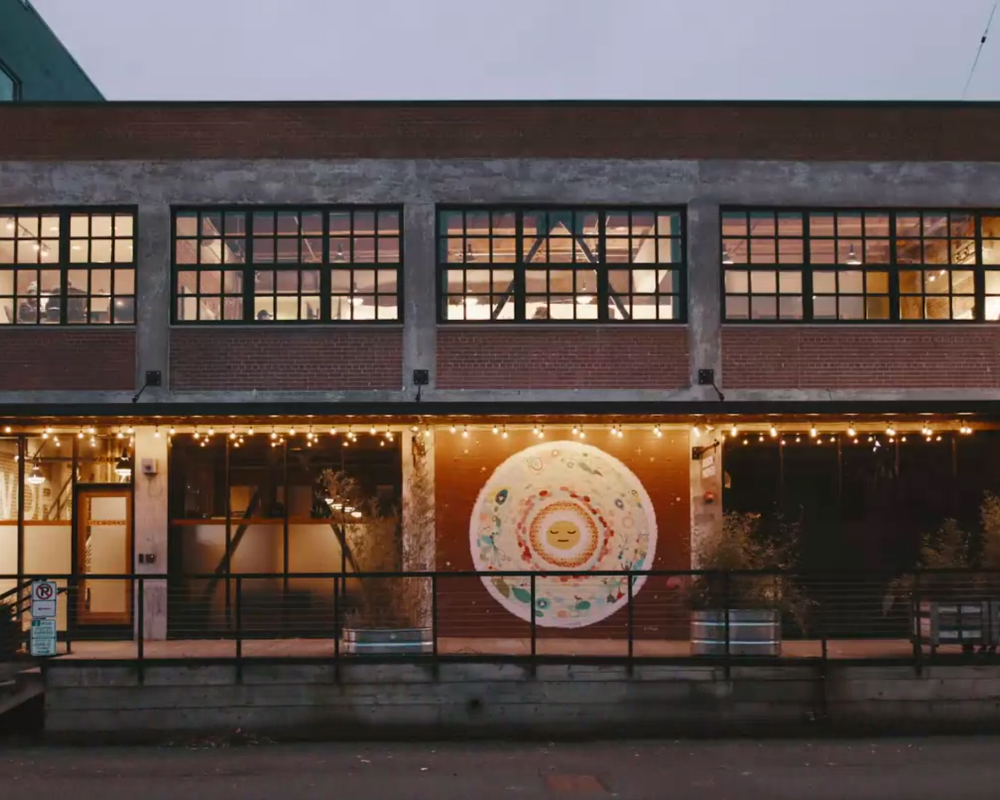

import { Link } from "gatsby"
import { graphql } from "gatsby"
import { Flex, Box, Heading, Text } from "rebass"
import Project from "./../components/Project"
import Container from "./../components/Container"
import SEO from "./../components/SEO"

import { sizes, colors } from "./../utils/variables"

<SEO title="Interactive Designer & UX Engineer" />

<Container width={sizes.large}>

<Box maxWidth={sizes.small} mx='auto'>

## I design and build useful websites, apps, and tools for everyone.

</Box>

</Container>

<Container text width={sizes.large}>
<Box sx={{
  display: 'grid',
  gridTemplateColumns: ['1fr', 'repeat(2, 1fr)'],
  gridGap: [4, 5],
  alignItems: 'center',
  mx: 'auto',
  my: [0, 3, 6]
}}>

<Project
  title='Supermaker'
  description='Visual Design, React'
  url='supermaker'
>

</Project>

<Project
  title='Schmidt’s'
  description='Interactive, Visual Design'
  url='schmidts'
>

</Project>

<Project
  title='Kajabi'
  description='Product Design'
  url='kajabi'
>

</Project>

<Project
  title='Touchstone Pathway'
  description='Product Design, Front-end'
  url='touchstone'
>

</Project>

<Project
  title='Changelog'
  description='Front-end, UI/UX Design'
  url='changelog'
>

</Project>

<Project
  title='Mower Parts'
  description='Prototyping, Front-end'
  url='scag'
>

</Project>

<Project
  title='Serra'
  description='Visual Design'
  url='serra'
>

</Project>

<Project
  title="Siteworks"
  description="Interactive Design"
  url="siteworks"
>

</Project>

</Box>
</Container>

