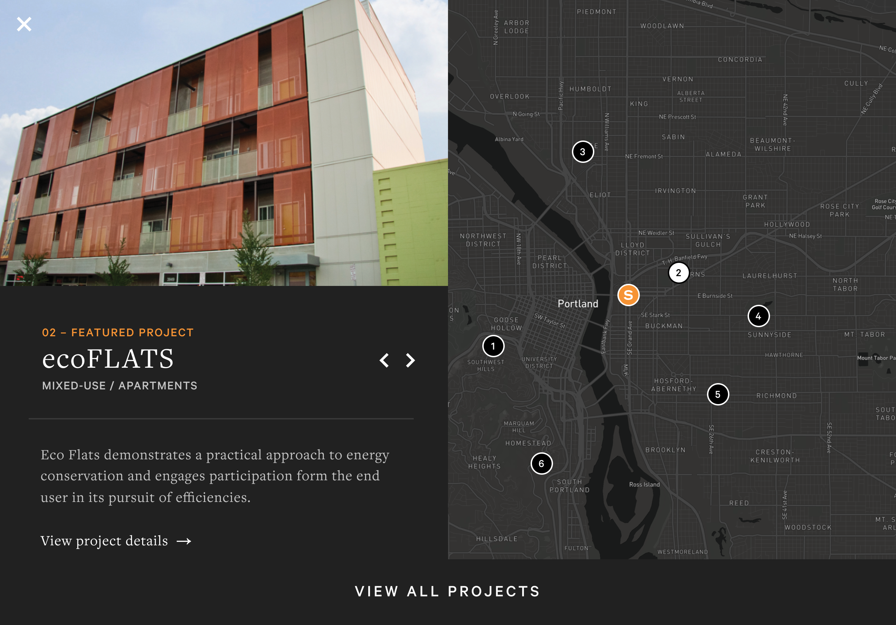
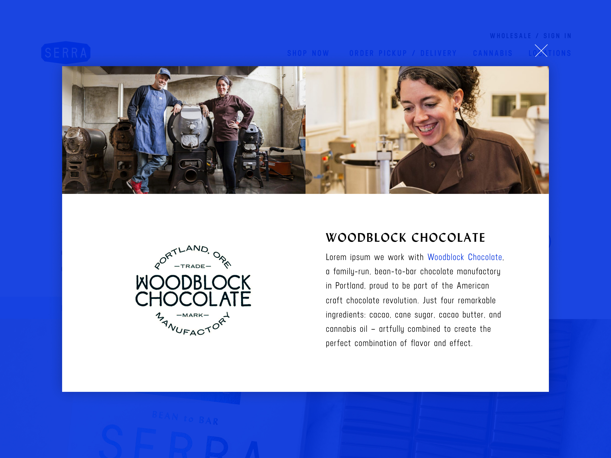

import { Link } from "gatsby"
import { graphql } from "gatsby"
import { Flex, Box, Heading, Text } from "rebass"
import Project from "./../components/Project"
import Container from "./../components/Container"
import SEO from "./../components/SEO"

import { sizes, colors } from "./../utils/variables"

<SEO title="Interactive Designer & UX Engineer" />

<Container width={sizes.large}>

<Box maxWidth={sizes.small} mx='auto'>

## I design and build useful apps, websites, and tools for people.

</Box>

</Container>

<Container text width={sizes.large}>
<Box sx={{
  display: 'grid',
  gridTemplateColumns: ['1fr', '1fr', 'repeat(2, 1fr)'],
  gridGap: [3, 5],
  alignItems: 'end',
  mx: 'auto',
}}>

<Project
  title='Schmidt’s'
  description='Interactive'
  url='schmidts'
  background={colors.schmidts.bone}
  color={colors.schmidts.slate}
>

</Project>

<Project
  title='Supermaker'
  description='Visual, React'
  url='supermaker'
  background={colors.supermaker.red}
  color={colors.supermaker.black}
>

</Project>

<Project
  title='Changelog'
  description='Front-end, UI/UX'
  url='changelog'
  background={colors.changelog.black}
  color={colors.changelog.green}
>

</Project>

<Project
  title='Touchstone Pathway'
  description='Front-end, UI/UX'
  url='touchstone'
  background={colors.touchstone.navy}
  color={colors.touchstone.cream}
>

</Project>

<Project
  title="Siteworks"
  description="Interactive"
  url="siteworks"
  background={colors.siteworks.darkgray}
  color={colors.siteworks.orange}
>

</Project>

<Project
  title='Serra Wholesale'
  description='Visual'
  url='serra'
  background={colors.serra.blue}
  color={colors.serra.white}
>

</Project>

</Box>
</Container>
