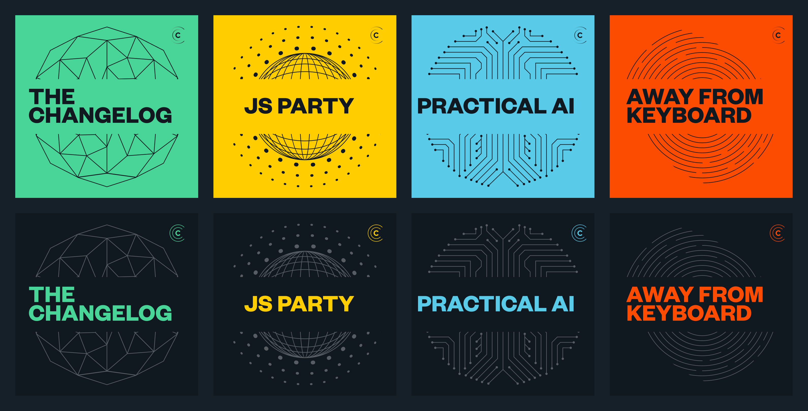
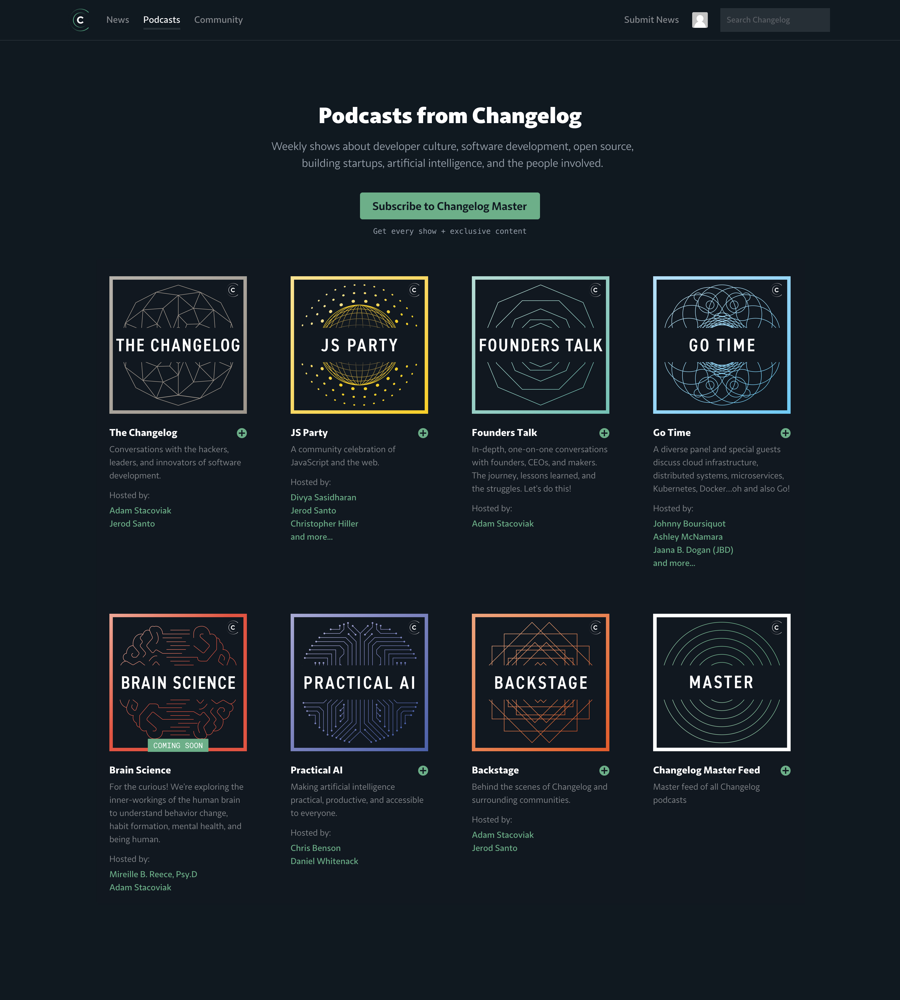
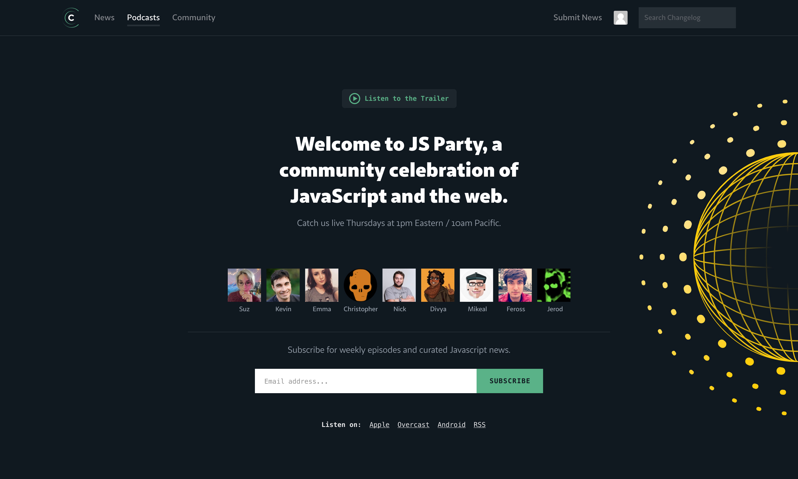
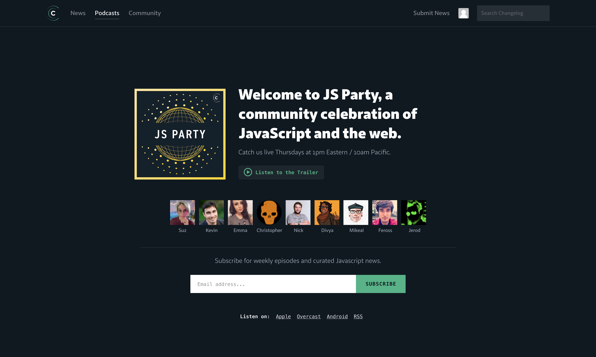
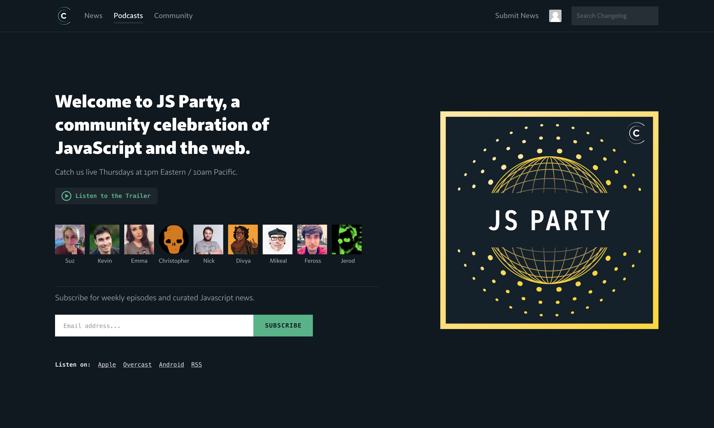
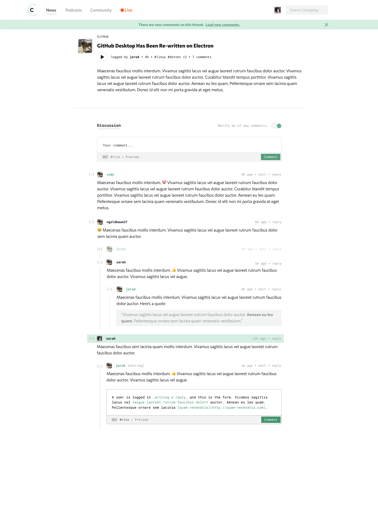
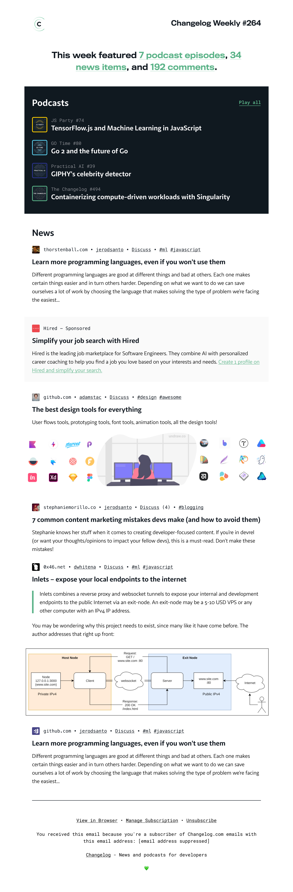

import Image from "./../../components/Image"
import { Flex, Box, Heading, Text } from "rebass"
import { Global, css } from "@emotion/core"
import { Link } from "gatsby"
import Container from "./../../components/Container"
import SEO from "./../../components/SEO"
import { sizes, colors } from "./../../utils/variables"

<SEO title="Changelog" />

<Global
  // TODO: Fix this shit! It should be using ThemeProvider
  styles={css`
    html {
      background: ${colors.changelog.black};
    }
    body,
    a {
      color: ${colors.changelog.green};
    }
  `}
/>

<Container>

# Changelog

Branding, visual design, and front-end development for a podcasting startup targed at a tightknit community of developers. Over the course of several months, I collaborated with a small team internally and externally to continue pushing an already well-established brand&rsquo;s look and feel forward.

[Live website](https://changelog.com/)

</Container>

<Container width={sizes.medium}>

</Container>

<!-- /// NEW SECTION \\\ -->

<Container text>

## Podcast heroes

Tasked with refining the podcast pages and heroes. My goal was to bring focus to actionable items, enhance visual appeal of the podcast artwork, and boost importance of community member avatars.

</Container>

<Container width={sizes.large}>

</Container>

<!-- /// NEW SECTION \\\ -->

<Container text>

## Upgraded layouts

The original news and blog post layout was great, but it didn&rsquo;t allow for rich media content such as video and audio embedding.

</Container>

<Container width={sizes.medium}>

<Container text>

## Improved comments

I helped design and build a new comment thread, allowing for the use of Markdown and, crucially, emojis.

</Container>

</Container>

<!-- /// NEW SECTION \\\ -->

<Container text>

## Weekly newsletter

Changelog reaches much of its community via opt-in emails. We wanted to draw attention to latest podcast episodes, as well

</Container>

<Container grid width={sizes.large}>

<Box>

<small>Original layout</small>

</Box>

<Box>

<small>Proposed layout</small>

</Box>

</Container>

<!-- /// NEXT PROJECT \\\ -->

<Container text>

**Next project:**

<Link to='/project/touchstone'>

<Heading fontSize={[6, 7, 8]}>Touchstone Pathway</Heading>

</Link>

</Container>
