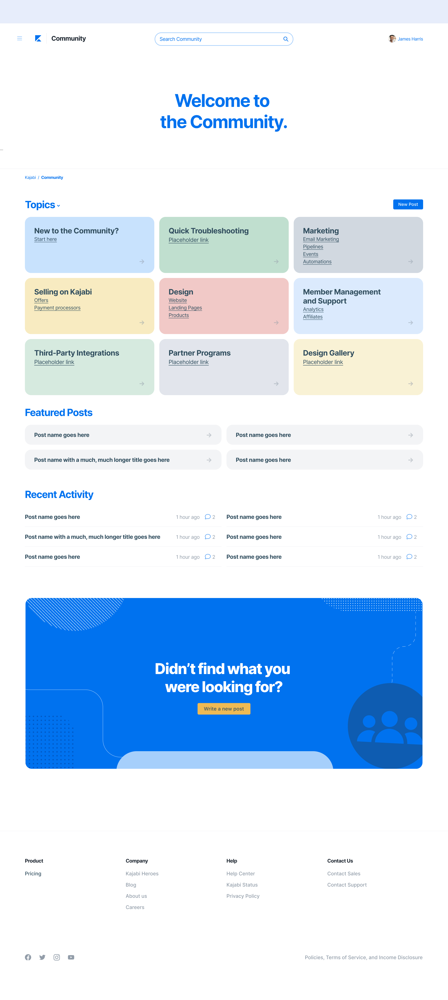
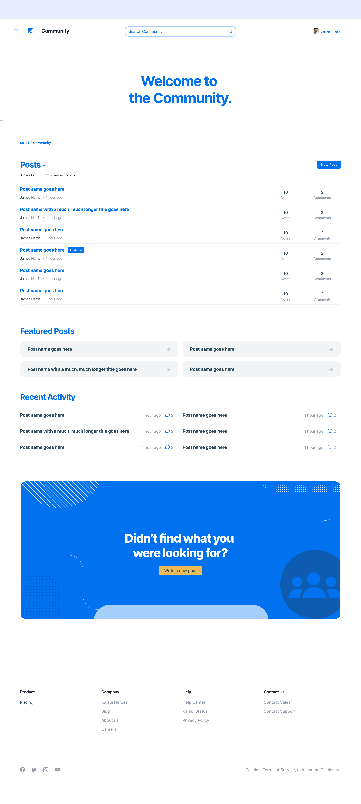
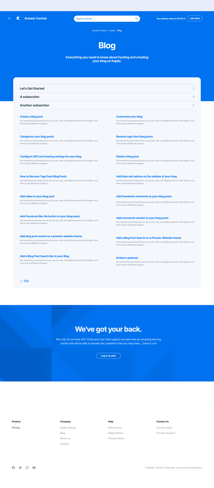

import Image from "./../../components/Image"
import { Flex, Box, Heading, Text } from "rebass"
import { Global, css } from "@emotion/core"
import { Link } from "gatsby"
import Container from "./../../components/Container"
import SEO from "./../../components/SEO"
import { sizes, colors } from "./../../utils/variables"

<SEO title="Kajabi" />

<Global
  // TODO: Should be using ThemeProvider
  styles={css`
    html {
      background: ${colors.kajabi.lightblue};
    }
    body,
    a {
      color: ${colors.kajabi.darkblue};
    }
    .gatsby-resp-image-image {
      box-shadow: none !important;
    }
  `}
/>

<Container>

# Kajabi

Visual and product design for Kajabi Help Desk and Community, built on Zendesk Help Center. Kajabi is a platform that helps business owners create and sustain a successful business online. I was asked to aid Kajabi&rsquo;s in-house designer with reimagining the look and feel of their Help Center.

[Live website](https://help.kajabi.com/hc/en-us)

</Container>

<Container width={sizes.small}>

</Container>

<!-- /// NEW SECTION \\\ -->

<Container text>

## Community

</Container>

<Container width={sizes.large}>

<Box maxWidth={sizes.medium} mx={'auto'} mt={4}>

</Box>

</Container>

<!-- /// NEXT PROJECT \\\ -->

<Container text>

**Next project:**

<Link to='/project/supermaker'>

<Heading fontSize={[6, 7, 8]}>Supermaker</Heading>

</Link>

</Container>
