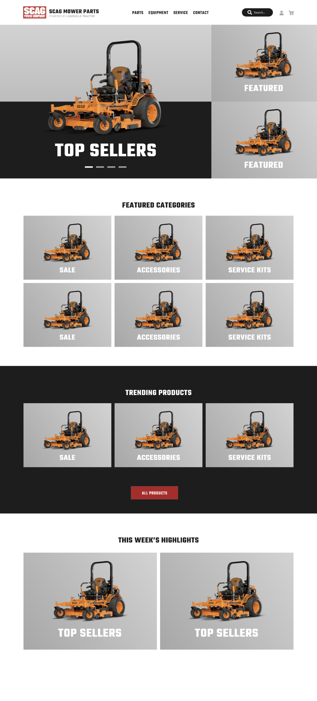

import Image from "./../../components/Image"
import { Flex, Box, Heading, Text } from "rebass"
import { Global, css } from "@emotion/core"
import { Link } from "gatsby"
import Container from "./../../components/Container"
import SEO from "./../../components/SEO"
import { sizes, colors } from "./../../utils/variables"

<SEO title="Anderson&rsquo;s Scag Parts" />

<Global
  // TODO: Should be using ThemeProvider
  styles={css`
    html {
      background: ${colors.scag.red};
    }
    body,
    a {
      color: ${colors.scag.white};
    }
  `}
/>

<Container>

# Mower Parts

Front-end development, UI/UX design. Demo project created in conjunction with the design phase to gain confidence in working with new front-end tooling, [Gridsome.js](https://gridsome.org/) and [Tailwind CSS](https://tailwindcss.com/). This was an experiment of moving fast, getting rough design ideas nailed down in Figma and immediately jumping into rapid prototyping.

Using Gridsome and Tailwind together was pretty nice. The tools helped avoid managing dozens of screens and user flows in a design program like Figma or Adobe XD. This was a spec project where I was able to experiment a bit; time will tell if this is a viable step in my design process.

[Live demo](https://crosby-scag.netlify.app/) | [Github repo](https://github.com/ericrowan/scag)

</Container>

<!-- /// NEW SECTION \\\ -->

<Container width={sizes.xlarge} mx='auto'>

<Box height="80vh" style="border: 1rem solid #222; border-radius: 0.5em;">
  <iframe
    id="inlineFrame"
    title="Scag Mower Parts demo"
    width="100%"
    height="100%"
    src="https://crosby-scag.netlify.app/"
    frameBorder="0"
  ></iframe>
</Box>

</Container>

<!-- /// NEW SECTION \\\ -->

<Container text>

## The design

Just a quick mockup created in Figma to get started:

</Container>

<Box width={sizes.small} mx='auto'>

</Box>

<!-- /// NEXT PROJECT \\\ -->

<Container text>

**Next project:**

<Link to='/project/serra'>

<Heading fontSize={[6, 7, 8]}>Serra</Heading>

</Link>

</Container>

