import Image from "./../../components/Image"
import { Flex, Box, Heading, Text } from "rebass"
import { Global, css } from "@emotion/core"
import { Link } from "gatsby"
import Container from "./../../components/Container"
import SEO from "./../../components/SEO"
import { sizes, colors } from "./../../utils/variables"

<SEO title="Supermaker" />

<Global
  // TODO: Fix this shit! It should be using ThemeProvider
  styles={css`
    html {
      background: ${colors.supermaker.pink};
    }
    body,
    a {
      color: ${colors.supermaker.black};
    }
  `}
/>

<Container>

# Supermaker

Prototyping, visual design, and front-end development for a new editorial platform built for makers and entrepreneurs of maker companies. Tight project turnaround and small team didn&rsquo;t take away from the client&rsquo;s willingness to explore and experiement visually &mdash; bold patterns and colors &mdash; and technically, with React and styled-components.

[Live website](https://supermaker.com/)

</Container>

<Container full grid backgroundColor={colors.supermaker.white} sx={{
  paddingY: '4vmax !important'
}}>

<Box alignSelf='center' mx={[0, 'auto']} maxWidth={['100%', sizes.xsmall]} mb={[2, 0]} color={colors.supermaker.red}>

### Early experiments

We scoured print magazines and other editorials for inspiration and ideas. Mixing and matching elements, the first concepts for look-and-feel were presented.

</Box>

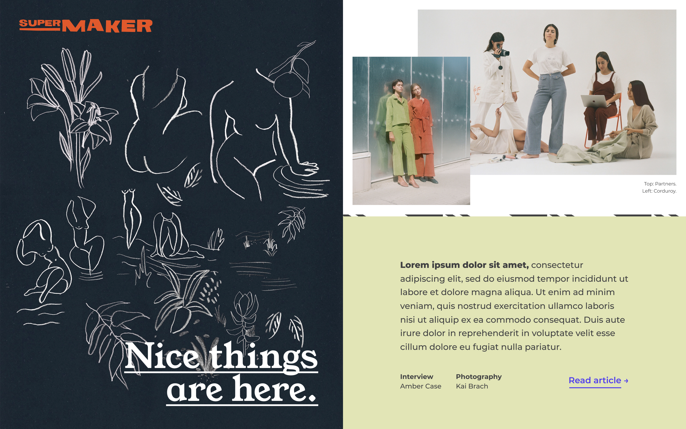

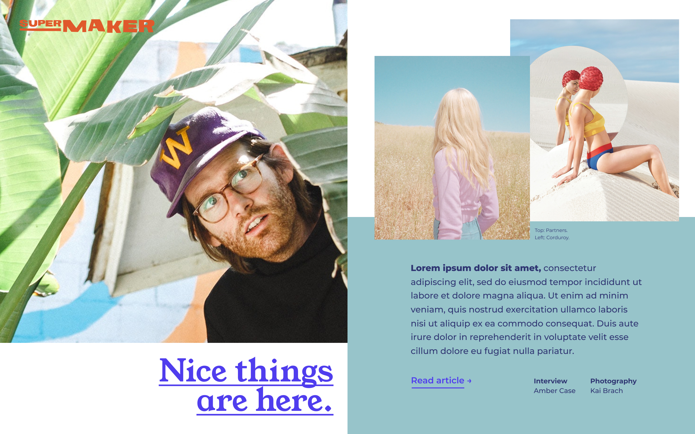

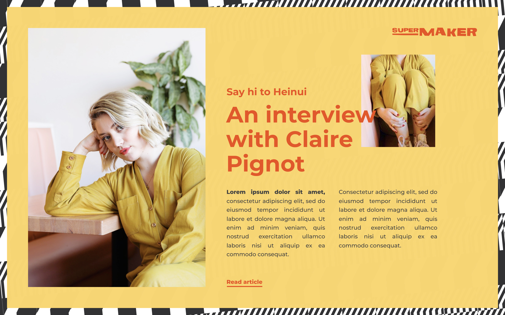

</Container>

<!-- /// NEW SECTION \\\ -->

<Container text>

## Prototyping

One of the ways we were able to experiement was through UX interactions; I designed and prototyped several different visual styles and user interactions in Figma (top). Eventually, we mapped out the website (bottom) to help present our vision to the client before proceeding, we then built those experiments out using libraries such as React, Craft CMS, and styled-components.

</Container>

<Container width={sizes.large}>

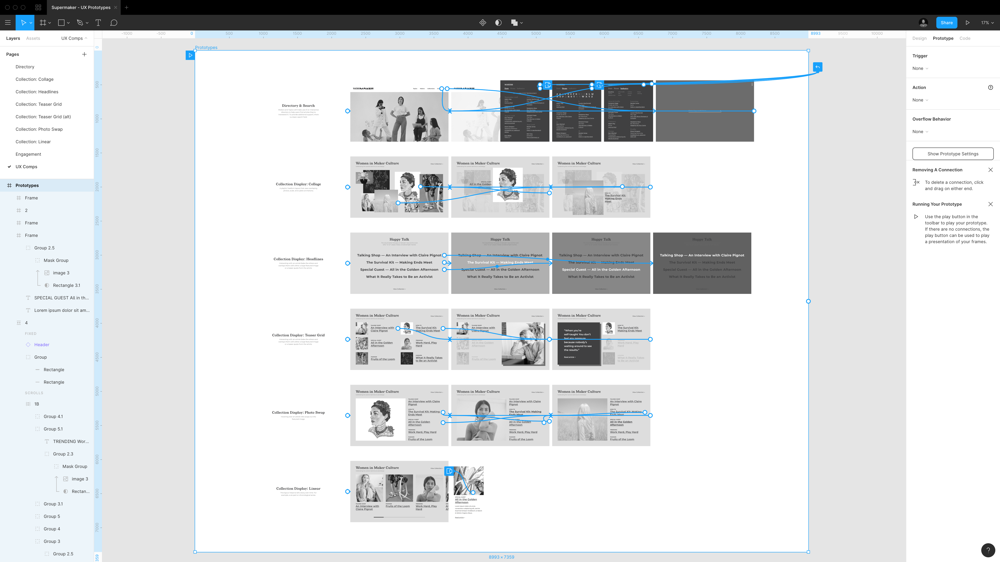

</Container>

<!-- /// NEW SECTION \\\ -->

<Container text>

## Design system

To start the project, our team worked with a brand designer which delivered basic branding elements: colors, patterns, and logo variations. Based around that we created colorways and typography options that would make each section of the website highly customizable by content editors, adhering to the visual language we helped build.

</Container>

<Container width={sizes.medium}>

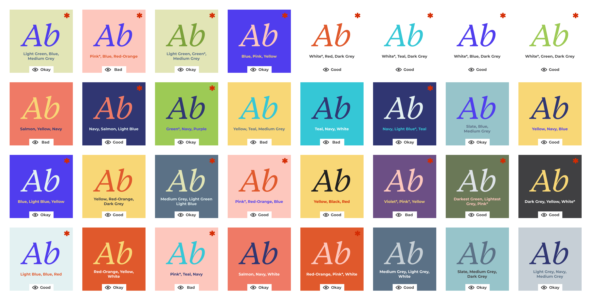

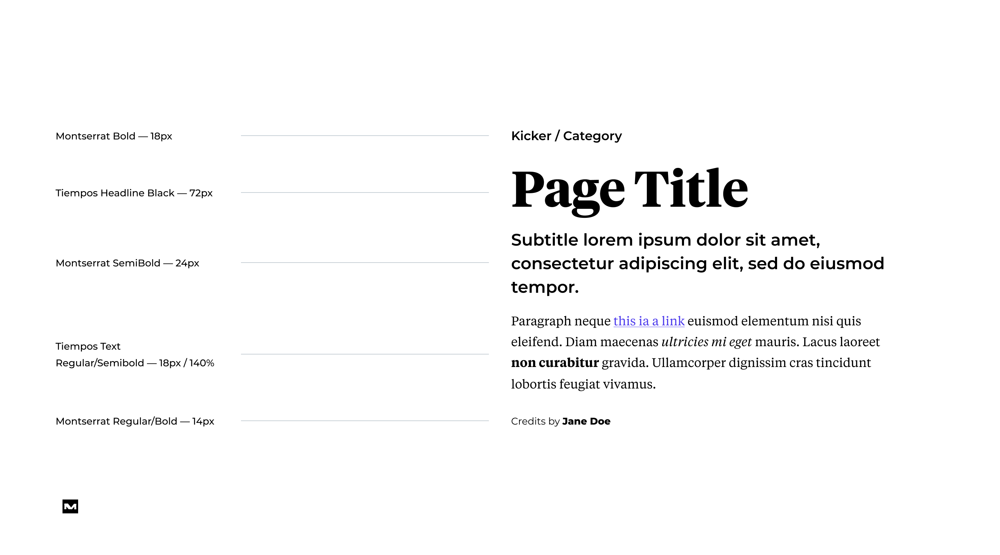

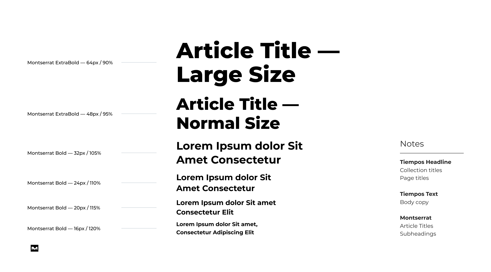

</Container>

<!-- /// NEW SECTION \\\ -->

<Container text>

## Bold heroes

Being the standout component of both the homepage and on every article post, we knew we had to get the hero layout just right. To do this, we created dozens of variations in layout, typeface, and color, and eventually narrowed it down to four or five standouts.

</Container>

<Container grid width={sizes.large}>

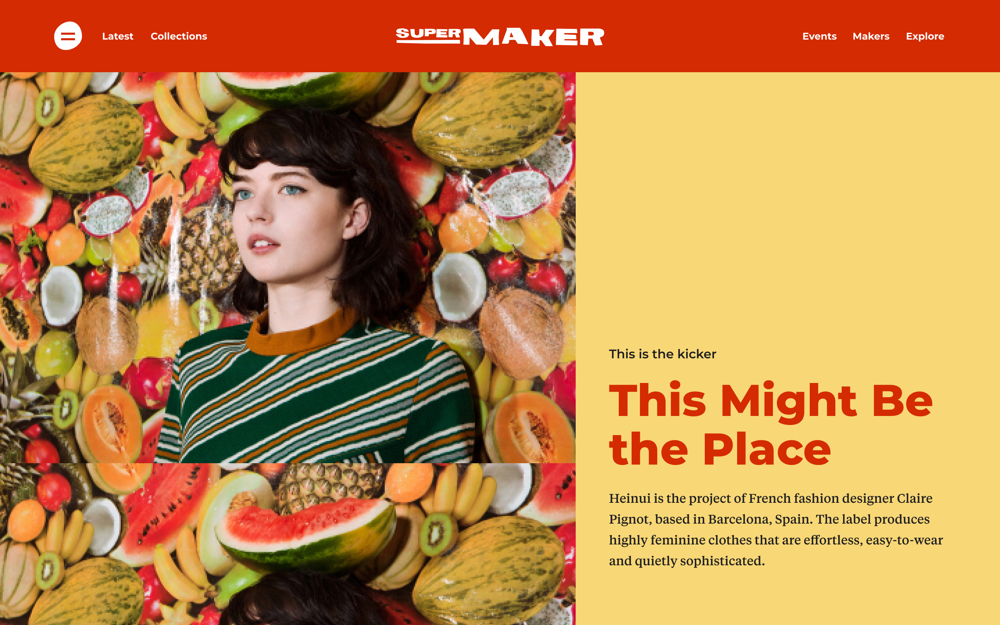

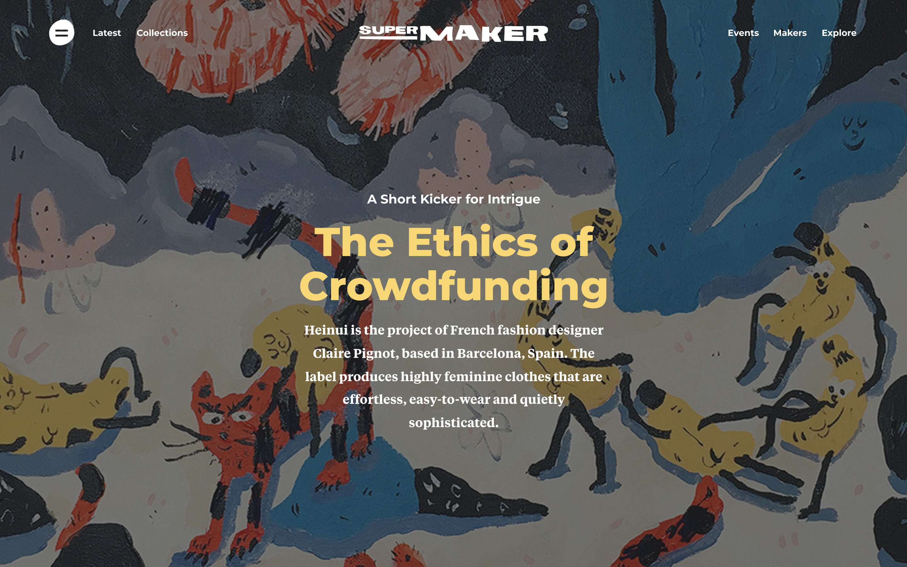

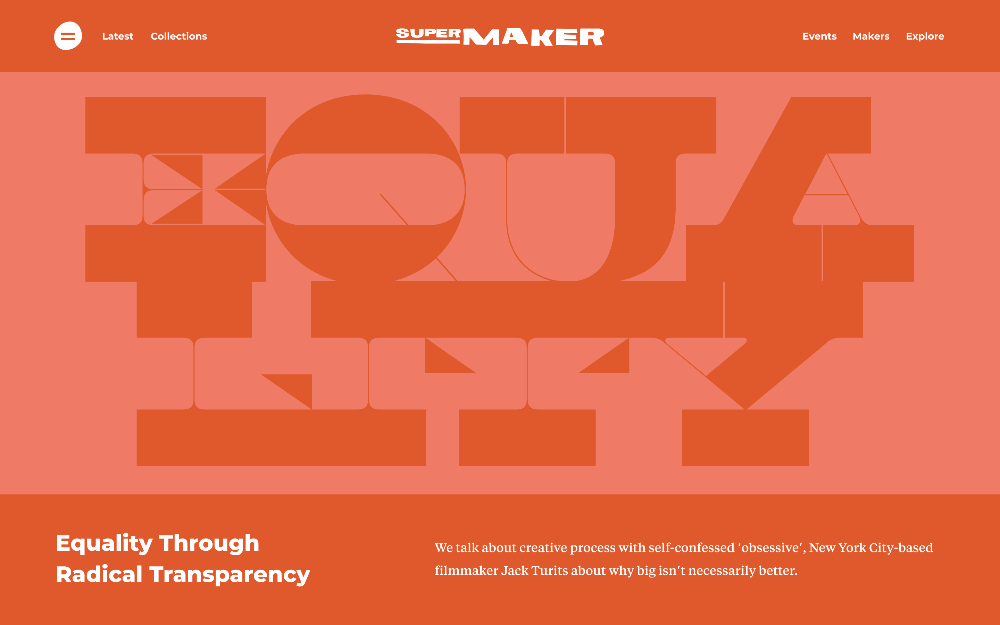

</Container>

<!-- /// NEW SECTION \\\ -->

<Container text>

## Topics and collections

Collections &mdash; articles grouped by particular type &mdash; help create an experience so that the user can discover content and help develop a stronger connection from regular readers of the website.

</Container>

<Container grid width={sizes.large} sx={{
  padding: '2em !important',
  backgroundColor: `${colors.supermaker.blue}`,
}}>

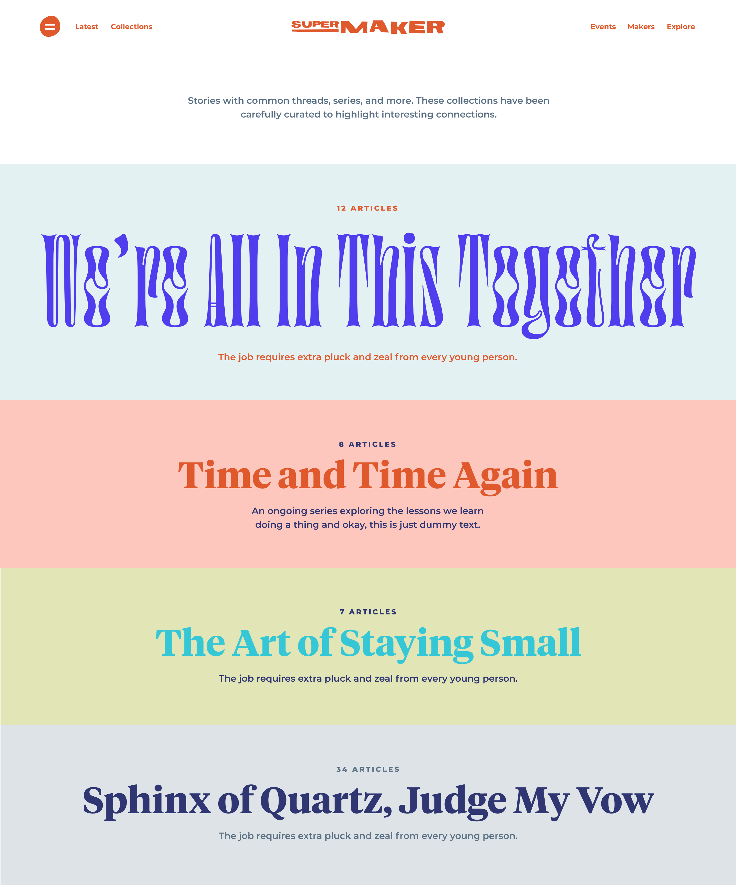

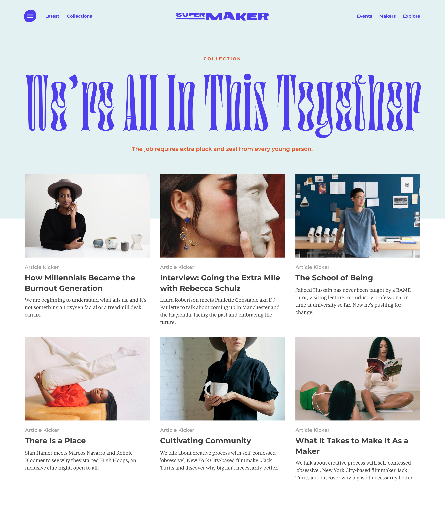

</Container>

<!-- /// NEW SECTION \\\ -->

<Container text>

## The homepage

With so many options for content, layout, color, image placement, and typography, it was super important to build every component so that they could be assembled (even in ways unknown to us) in a way that was highly flexible.

</Container>

<Container full grid>

<Box>

</Box>

</Container>

<!-- /// NEW SECTION \\\ -->

<Container text>

## Discovery

I designed, prototyped, and helped build the components that would help the user drill down into the content they are most interested in.

In addition, as this is an interactive community, we were tasked with building the ability for the client to appeal to their readership in creative, direct ways.

</Container>

<Container grid gridCols={'repeat(3, 1fr)'} width={sizes.large} sx={{
  padding: '2em !important',
  backgroundColor: `${colors.supermaker.red}`,
}}>

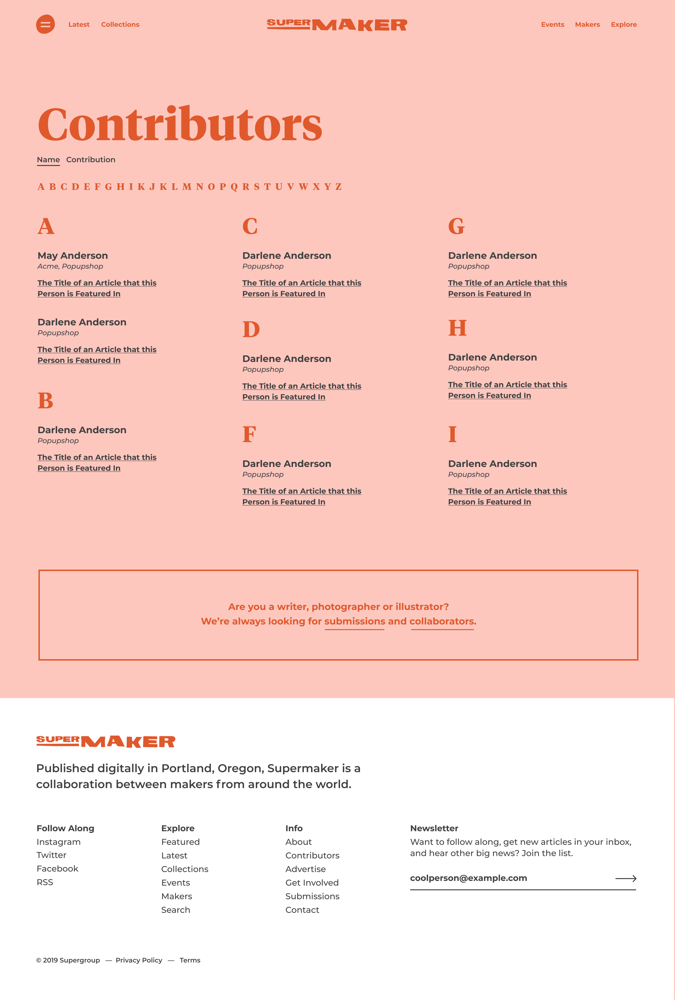

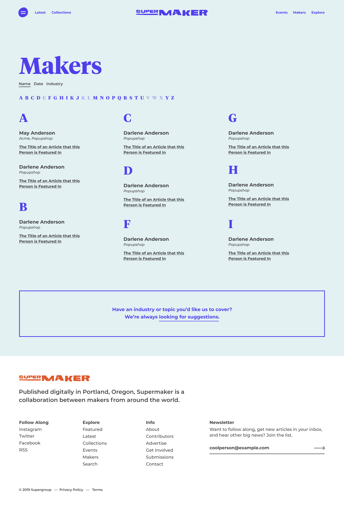

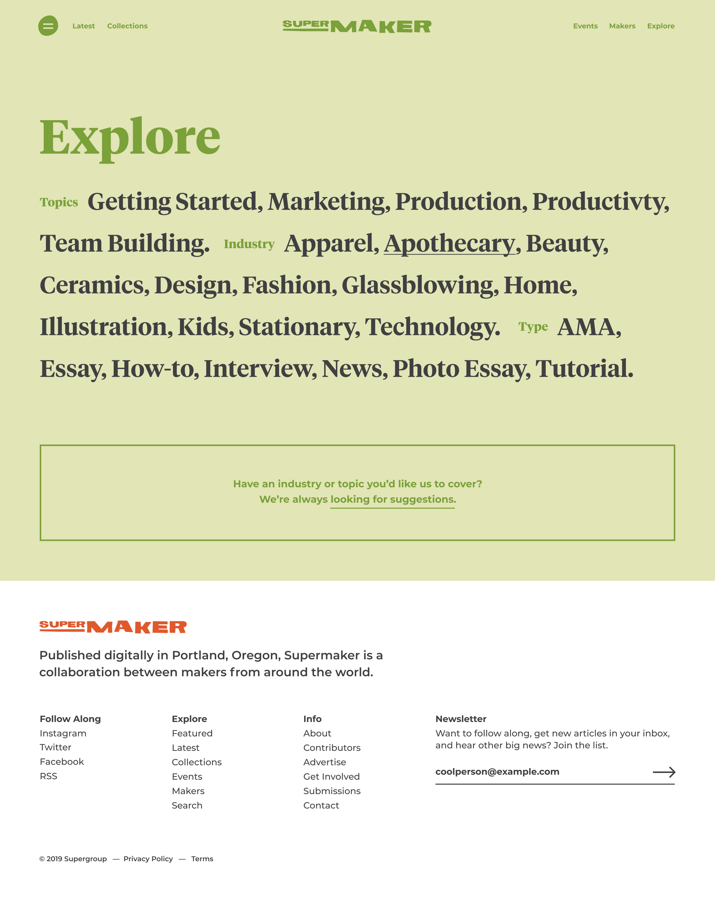

</Container>

<!-- /// NEW SECTION \\\ -->

<Container text>

## Art-directed articles

Similar to many other components mentioned above, each article layout was able to be fully customized. To help keep the writing as the central focus, it was decided the article body's text and background would remain black on white.

</Container>

<Container full grid>

</Container>

<!-- /// NEXT PROJECT \\\ -->

<Container text>

**Next project:**

<Link to='/project/changelog'>

<Heading fontSize={[6, 7, 8]}>Changelog</Heading>

</Link>

</Container>
