import Image from "./../../components/Image"
import { Flex, Box, Heading, Text } from "rebass"
import { Global, css } from "@emotion/core"
import { Link } from "gatsby"
import Container from "./../../components/Container"
import { sizes, colors } from "./../../utils/variables"

<Global
  // TODO: Fix this shit! It should be using ThemeProvider
  styles={css`
    html {
      background: ${colors.humanshapes.white};
    }
    *,
    a {
      color: ${colors.humanshapes.black};
    }
  `}
/>

<Container text>

# Human Shapes

Developer community based around podcasts and news discussions. Lorem ipsum dolor sit amet consectetur adipisicing elit. Sed nemo nihil, praesentium animi deleniti perspiciatis pariatur maxime rem amet illo inventore labore provident saepe aut ipsa incidunt culpa? Corporis in soluta, quisquam aliquid velit quae dolor sint asperiores iste doloribus!

</Container>

<Container width={sizes.large}>

</Container>

<Container text>

## Mobile nav

Sed nemo nihil, praesentium animi deleniti perspiciatis pariatur maxime rem amet illo inventore labore provident saepe aut ipsa incidunt culpa?

</Container>

<Container grid width={[1, 2 / 5]} sx={{
}}>

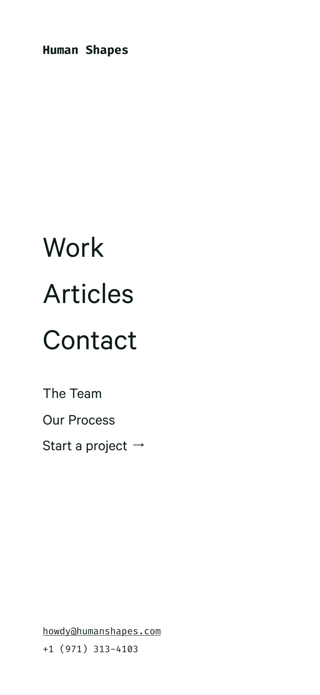

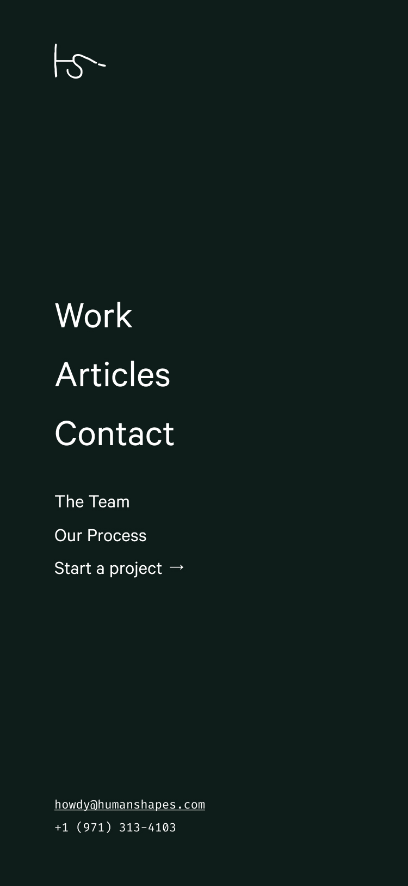

</Container>

<!-- /// NEW SECTION \\\ -->

<Container text>

## Website Owner’s Manual

Lorem ipsum dolor sit amet consectetur adipisicing elit. Sed nemo nihil, praesentium animi deleniti perspiciatis pariatur maxime rem amet illo inventore labore provident?

</Container>

<Container width={sizes.large}>

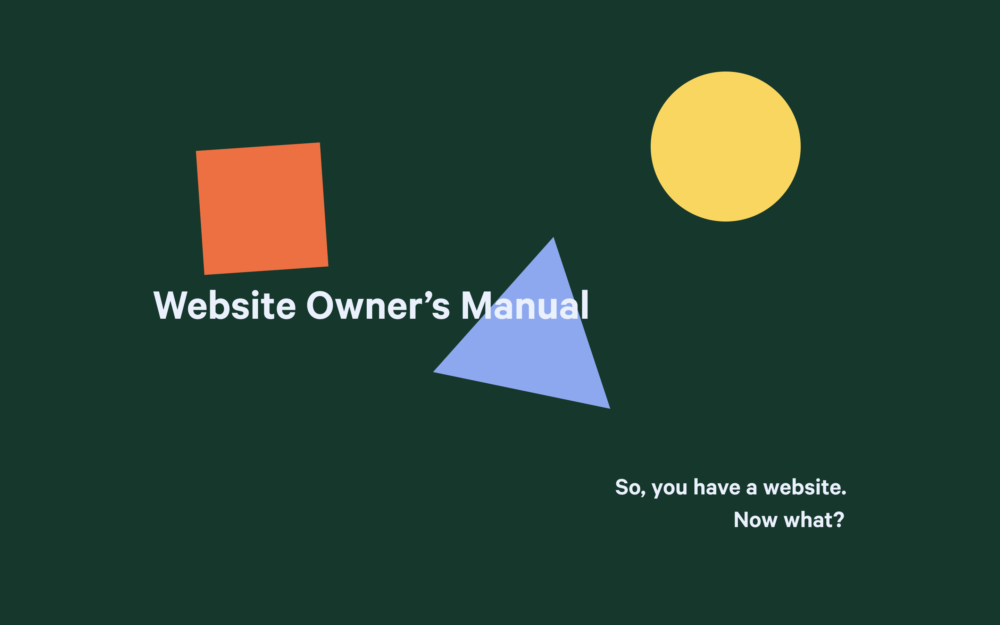

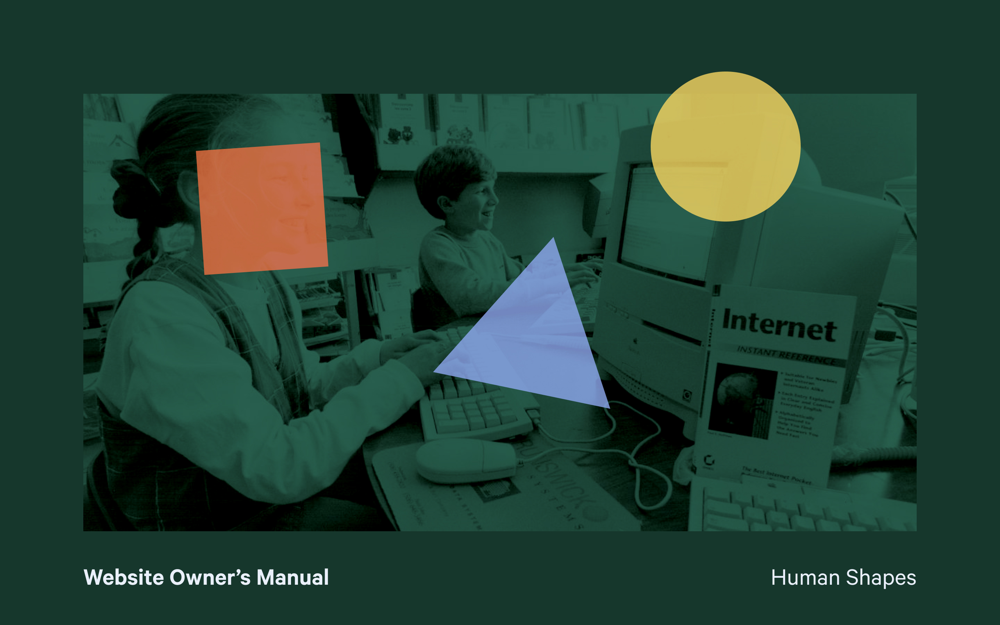

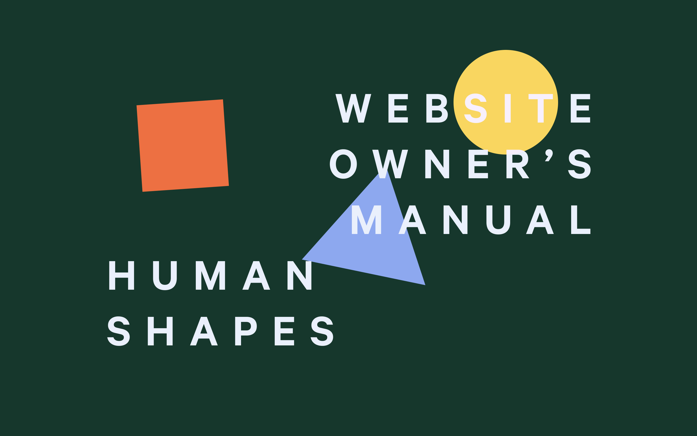

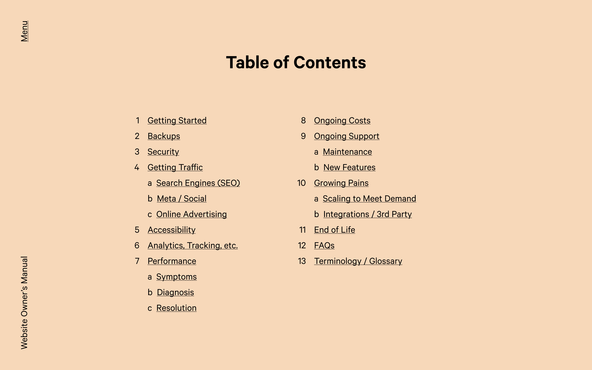

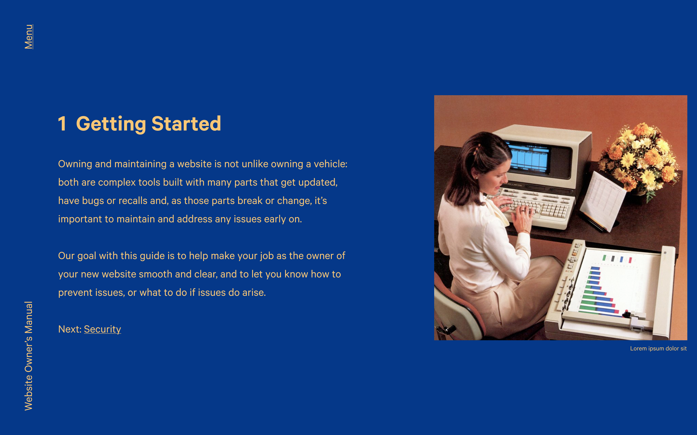

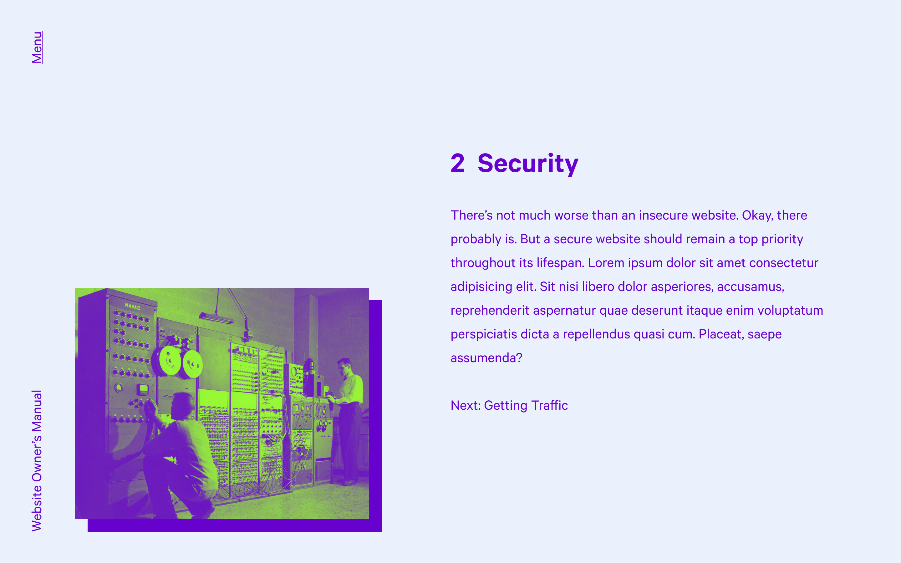

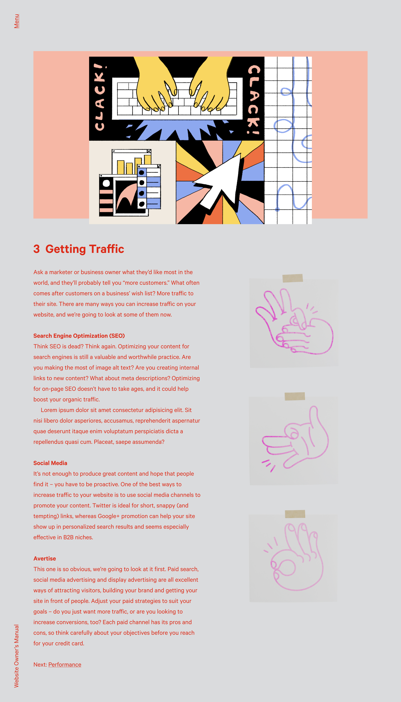

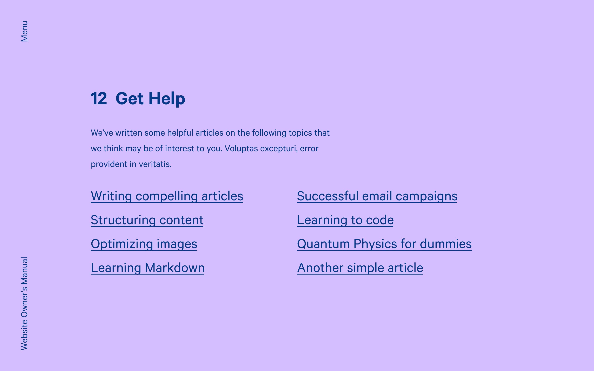

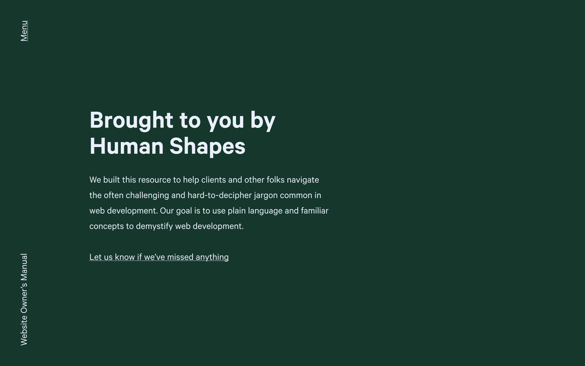

</Container>

<!-- /// NEXT PROJECT \\\ -->

<Container text>

**Next project:**

<Link to='/work/changelog'>

# Changelog

</Link>

</Container>
