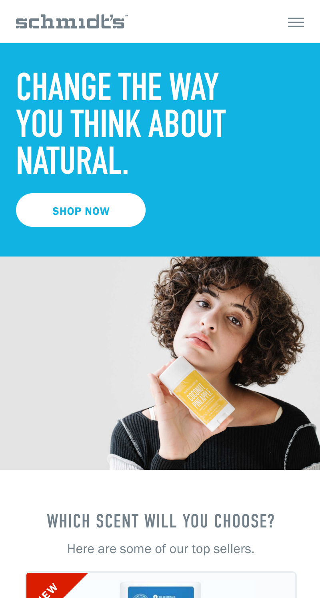
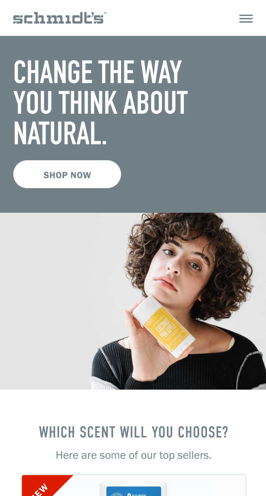
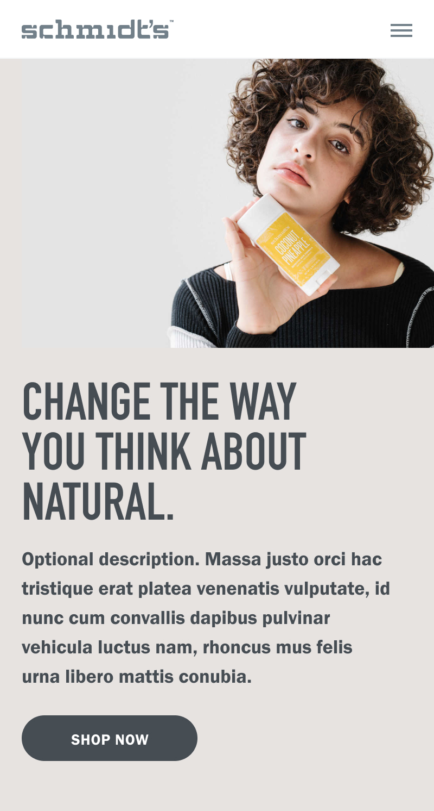
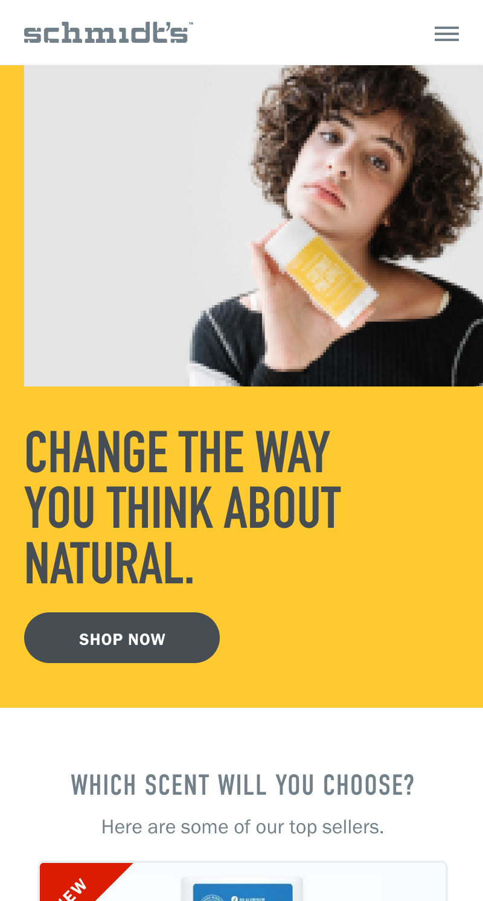

import Image from "./../../components/Image"
import { Flex, Box, Heading, Text } from "rebass"
import { Global, css } from "@emotion/core"
import { Link } from "gatsby"
import Container from "./../../components/Container"
import { sizes, colors } from "./../../utils/variables"

<Global
  // TODO: Fix this shit! It should be using ThemeProvider
  styles={css`
    html {
      background: ${colors.schmidts.bone};
    }
    *,
    a {
      color: ${colors.schmidts.slate};
    }
  `}
/>

<Container text>

# Schmidt’s

Developer community based around podcasts and news discussions. Lorem ipsum dolor sit amet consectetur adipisicing elit. Sed nemo nihil, praesentium animi deleniti perspiciatis pariatur maxime rem amet illo inventore labore provident saepe aut ipsa incidunt culpa? Corporis in soluta, quisquam aliquid velit quae dolor sint asperiores iste doloribus!

</Container>

<Box width={sizes.medium} mx='auto'>

</Box>

<!-- /// NEW SECTION \\\ -->

<Container text>

## Quick search

The podcast landing page was in need of a revamp. Here are some shots that
didn't make the cut. This is just placeholder text.

</Container>

<Container width={sizes.small} mx='auto'>

<!-- TODO: Re-export images to fix transparent bg -->

</Container>

<!-- /// NEW SECTION \\\ -->

<Container text>

## Optional layouts

Lorem ipsum dolor sit amet consectetur adipisicing elit. Sed nemo nihil, praesentium animi deleniti perspiciatis pariatur maxime rem amet illo inventore labore provident?

</Container>

<Container full grid sx={{
  px: 4,
}}>

</Container>

<Container text>

## Set and forget

Lorem ipsum dolor sit amet consectetur adipisicing elit. Sed nemo nihil, praesentium animi deleniti perspiciatis pariatur maxime rem amet illo inventore labore provident?

</Container>

<Container full grid sx={{
  px: 4,
  // display: 'grid',
  // gridTemplateColumns: '1fr 1fr',
  // gridGap: 4,
}}>

</Container>

<!-- /// NEW SECTION \\\ -->

<Container text>

## Mobile first

The podcast landing page was in need of a revamp. Here are some shots that
didn't make the cut. This is just placeholder text.

</Container>

<Container full grid gridCols='repeat(4, 1fr)' sx={{
  px: 4,
}}>

</Container>

<!-- /// NEXT PROJECT \\\ -->

<Container text>

**Next project:**

<Link to='/work/serra'>

# Serra

</Link>

</Container>
