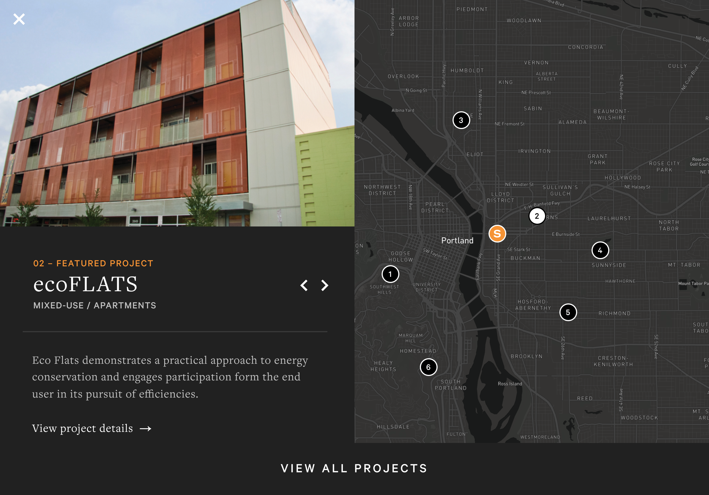

import Image from "./../../components/Image"
import { Flex, Box, Heading, Text } from "rebass"
import { Global, css } from "@emotion/core"
import { Link } from "gatsby"
import Container from "./../../components/Container"
import { sizes, colors } from "./../../utils/variables"

<Global
  // TODO: Fix this shit! It should be using ThemeProvider
  styles={css`
    html {
      background: ${colors.siteworks.darkgray};
    }
    body,
    a {
      color: ${colors.siteworks.orange};
    }
  `}
/>

<Container>

# Siteworks

Visual and interactive design, along with typography, were some of the ways I helped OMFGCo. when they reached out for help on a website build for their fellow Portland-based client, Siteworks.

I was tasked with doing a UX design audit on the website mockups, already in a pretty good spot, and worked with OMFGCo. to refine some key areas of the website, such as general design suggestions and improvements to typography.

</Container>

<Container width={sizes.medium}>

</Container>

<!-- /// NEW SECTION \\\ -->

<Container text>

## Interactive map

I also led UI/UX design on an interactive map that was requested by the client. The map provides users with the ability to view a portfolio of work from Siteworks in a useful way.

</Container>

<Container full>

<Box width={[1, 2 / 3]}>

</Box>

<Box width={[1, 2 / 3]} ml='auto'>

</Box>

</Container>

<!-- /// NEXT PROJECT \\\ -->

<Container text>

**Next project:**

<Link to='/work/serra'>

# Serra

</Link>

</Container>
