import Image from "./../../components/Image"
import { Flex, Box, Heading, Text } from "rebass"
import { Global, css } from "@emotion/core"
import { Link } from "gatsby"
import Container from "./../../components/Container"
import { sizes, colors } from "./../../utils/variables"

<Global
  // TODO: Fix this shit! It should be using ThemeProvider
  styles={css`
    html {
      background: ${colors.touchstone.navy};
    }
    body,
    a {
      color: ${colors.touchstone.cream};
    }
  `}
/>

<Container text>

# Touchstone

I led or assisted product design, ui/ux, and font-end development for this webapp built to help financial advisors understand their clients on a more personal level. Though this product had already been developed when I jumped on board, I quickly set out to identify sticking points in the user flow, reimagine the dashboard, and design a game.

</Container>

<!-- /// NEW SECTION \\\ -->

<Container text>

## Design language

Though the overall design of the app evolved during my time working on it, we tried to stay fairly loyal to the original guidelines.

</Container>

<Container>

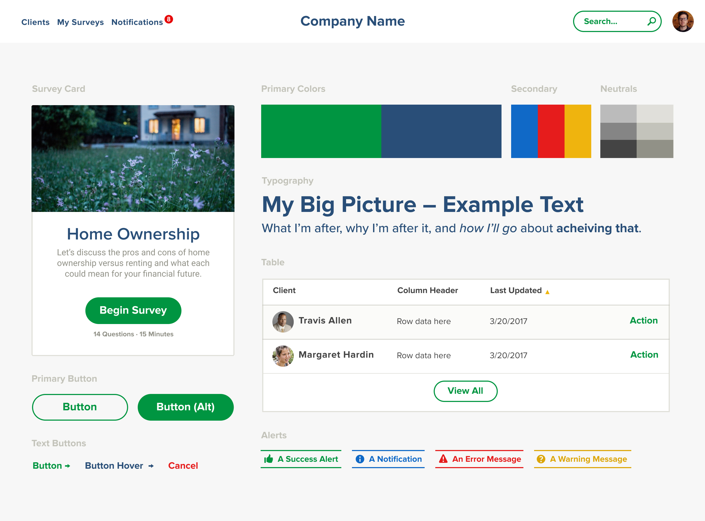

</Container>

<!-- /// NEW SECTION \\\ -->

<Container text>

## Onboarding flow

I found the app challenging to navigate when I first joined the project. One of the ways I helped solve this problem was by outlining clearly the main tasks a user might wish to accomplish.

</Container>

<Container width={sizes.medium}>

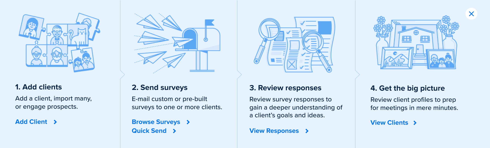

</Container>

<!-- /// NEW SECTION \\\ -->

<Container text>

## New dashboard

Users in the role of Advisor got a completely new dashboard experience. Originally just a few stats depicting some Client data, we pitched the idea of giving a much deeper look into what was going on under the hood, including an activity feed and notifications for the most important upcoming events.

</Container>

<Container width={sizes.large}>

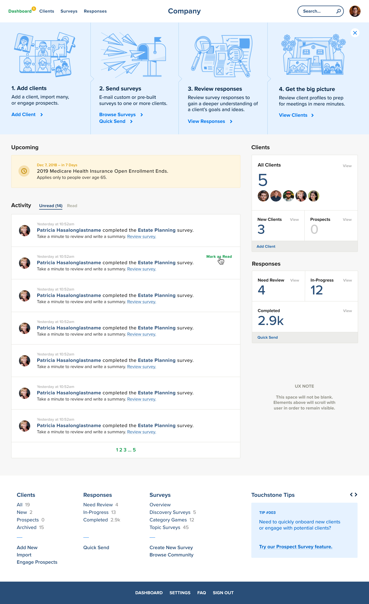

</Container>

<!-- /// NEW SECTION \\\ -->

<Container text>

## Early concepts

The client initially asked us to try to work more color into the dashboard. In the end it they decided to stick with a simpler direction.

</Container>

<Container full px={4}>

<Box width={[1, 2 / 3]}>

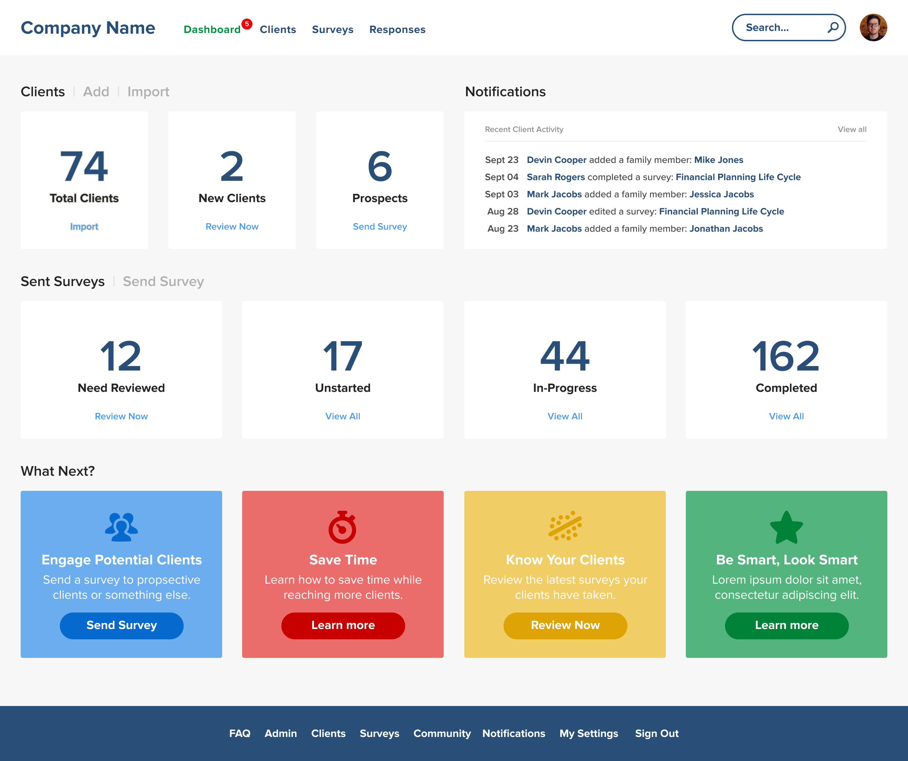

</Box>

<Box width={[1, 2 / 3]} mt={4} ml='auto'>

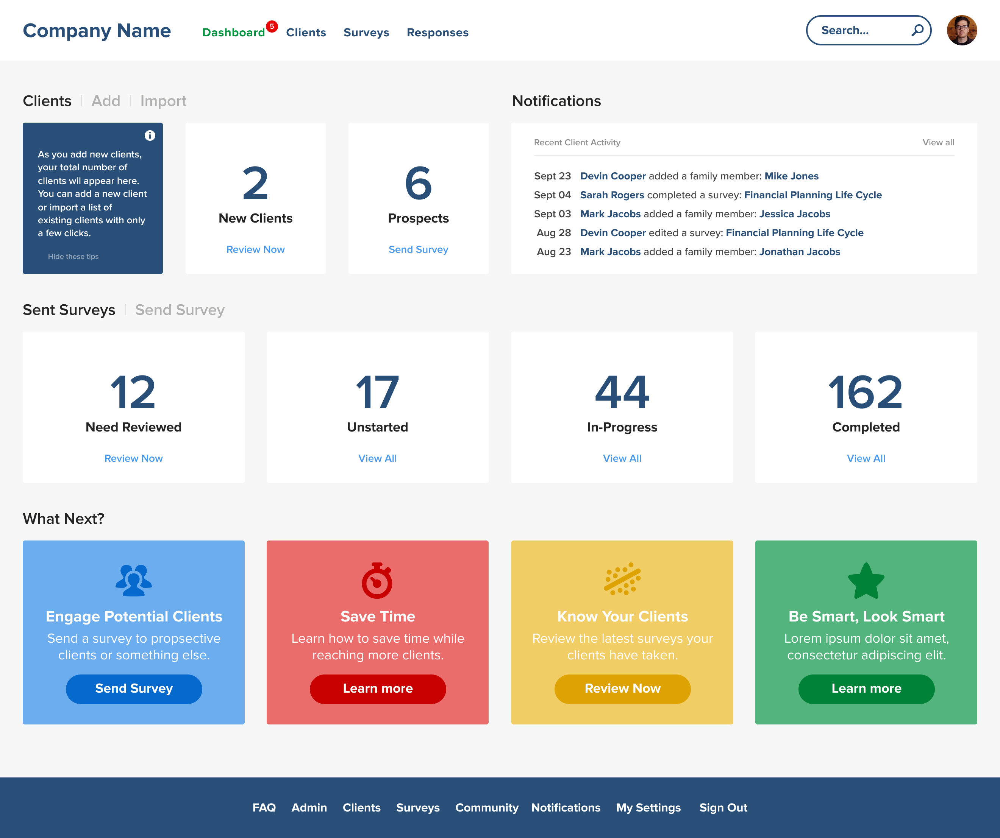

</Box>

</Container>

<!-- /// NEW SECTION \\\ -->

<Container text>

## Big picture

We revamped the Client&rsquo;s landing page to showcase recent surveys but, most importantly, to help provide more insightful content about each person.

</Container>

<Container full grid>

<Box>

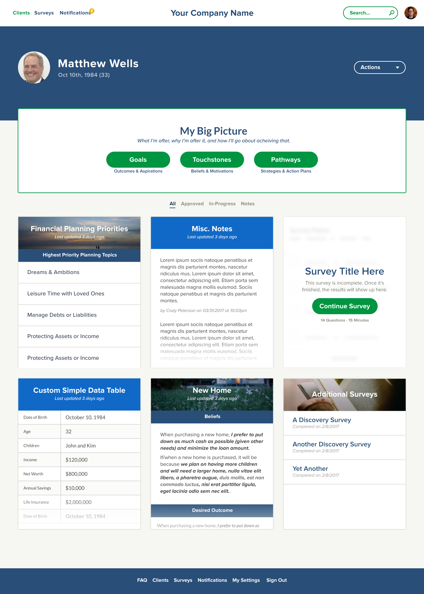

<small>Before</small>

</Box>

<Box mt={[0, 6]}>

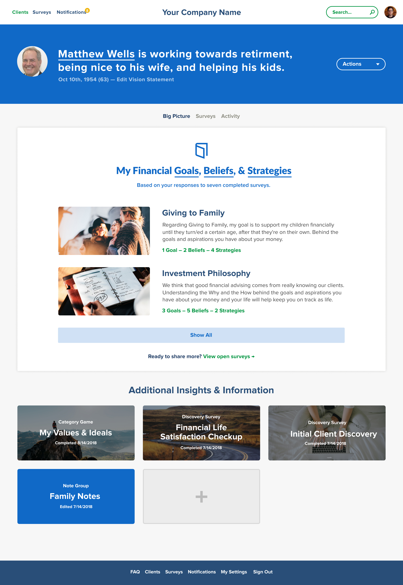

<small>After</small>

</Box>

</Container>

<!-- /// NEW SECTION \\\ -->

<Container text>

## Gathering data

Surveys are at the core of Touchstone. We worked and reworked certain aspects of how surveys look and function but, unfortunately, there was never a chance to completely rethink them.

</Container>

<Container maxWidth={sizes.small}>

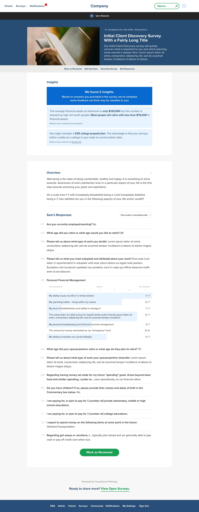

</Container>

<!-- /// NEW SECTION \\\ -->

<Container text>

## Engagement

In order to increase user engagement, I was responsible for redesigning the existing Category Game concept, as well as reworking the front-end code to be mobile friendly.

</Container>

<Container full grid>

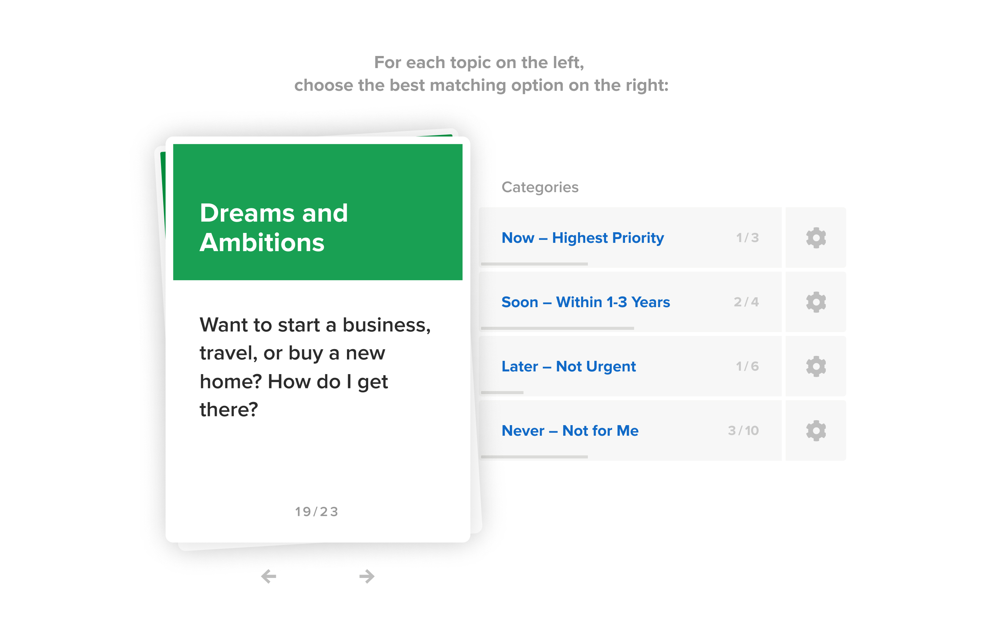

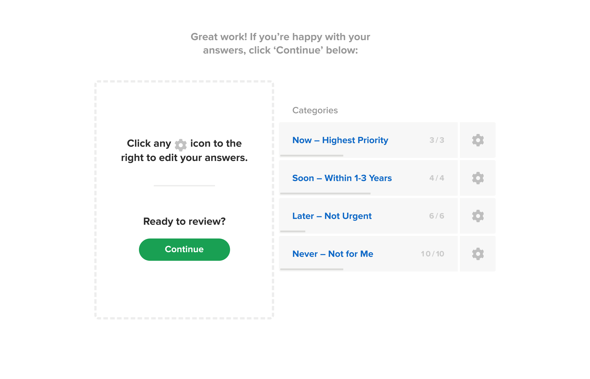

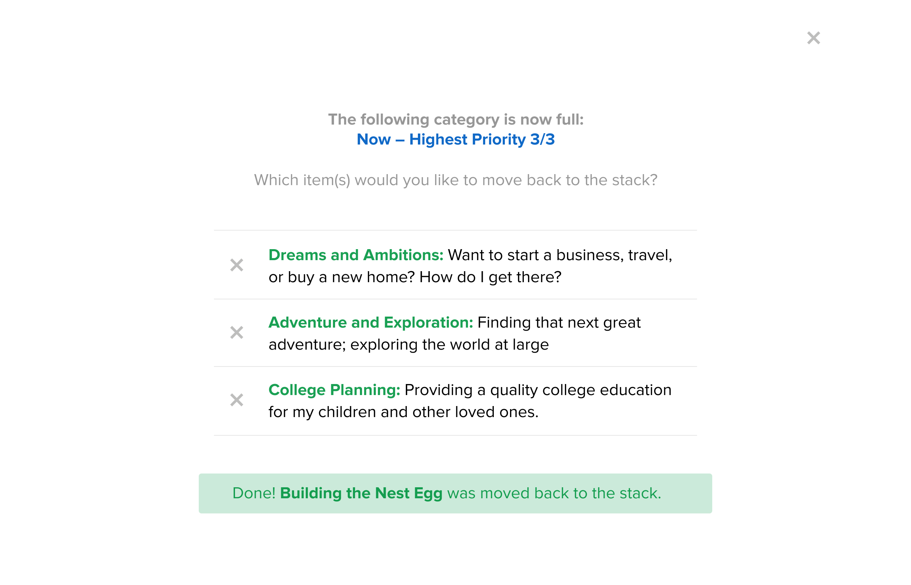

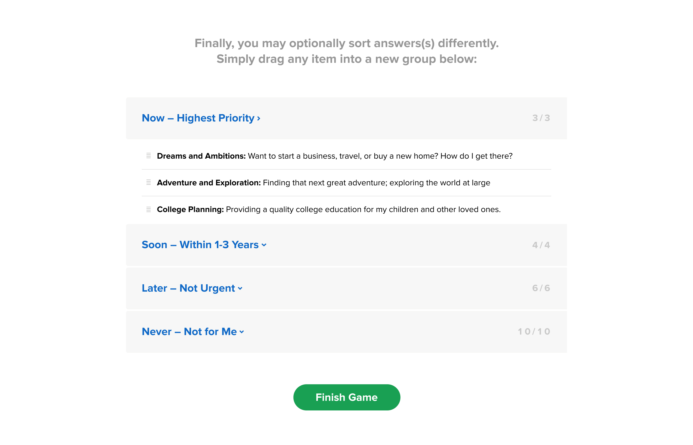

</Container>

<!-- /// NEW SECTION \\\ -->

<Container text>

## Notifications &amp; Settings

We designed and implemented an all-new notification center to help Advisors keep track of important milestones amongst their clients.

</Container>

<Container width={sizes.large}>

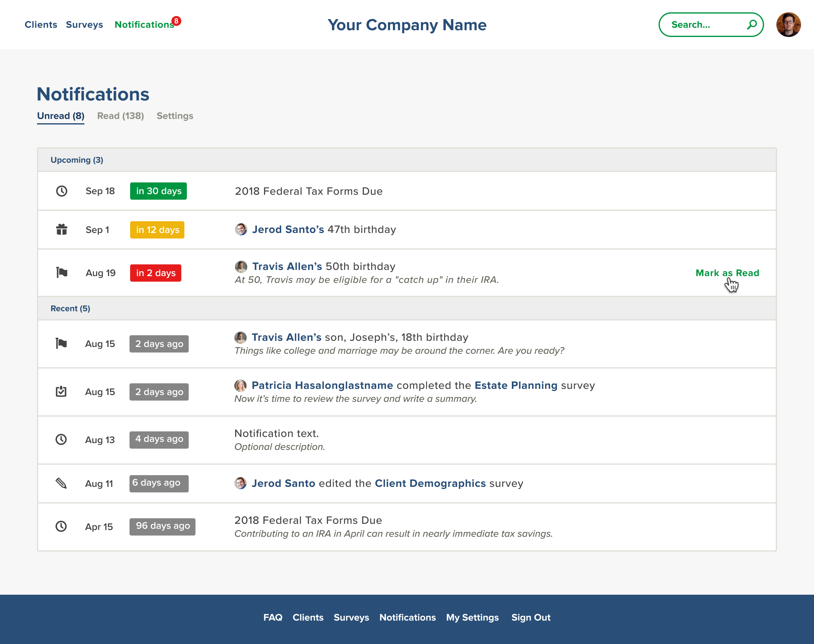

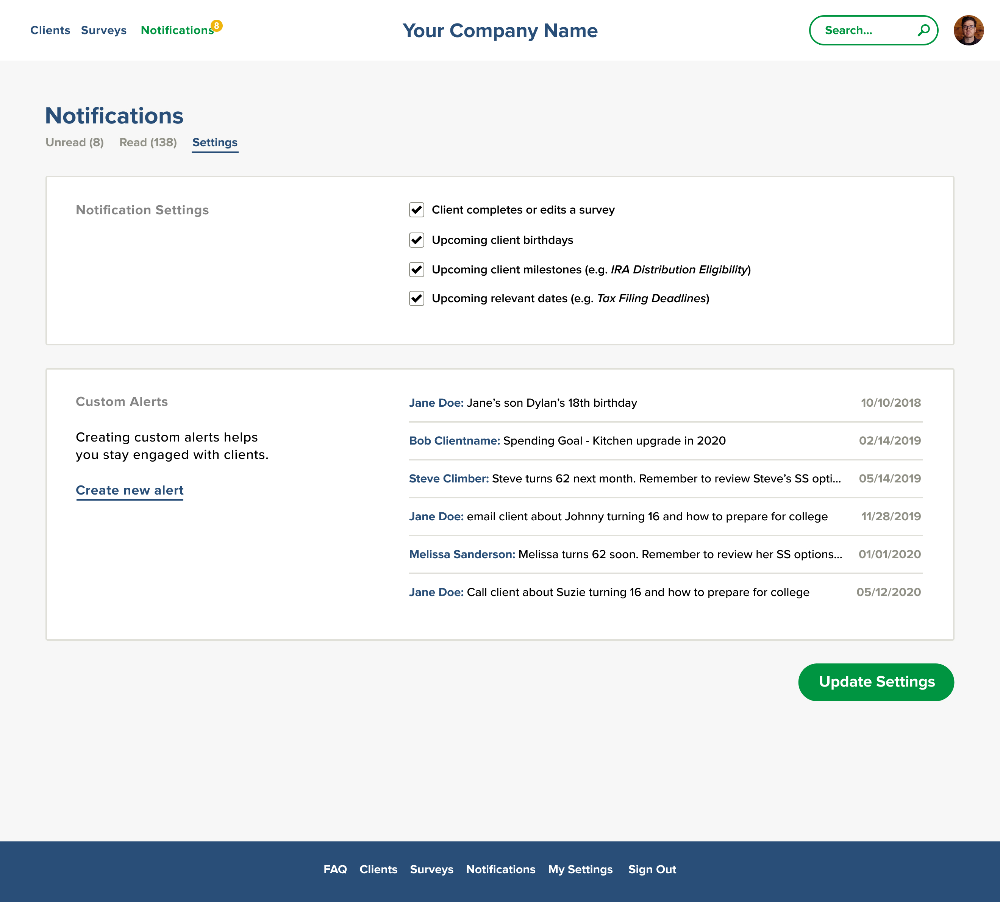

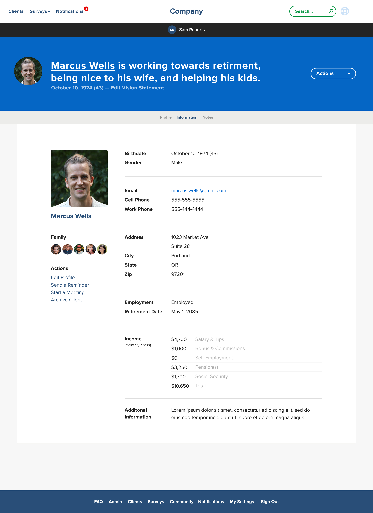

</Container>

<!-- /// NEXT PROJECT \\\ -->

<Container text>

**Next project:**

<Link to='/work/siteworks'>

# Siteworks

</Link>

</Container>
